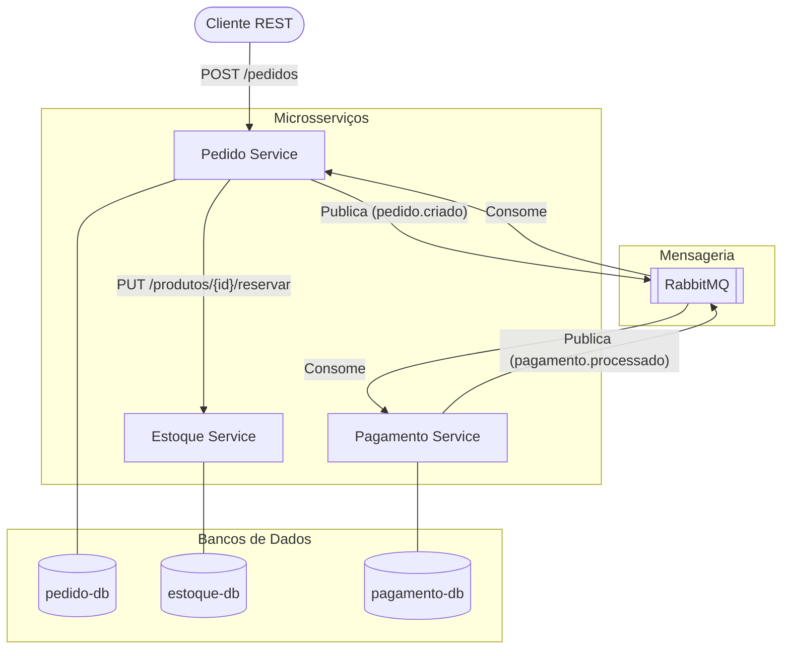

# Entrega - Laboratório Avaliativo Prático: Construindo uma Arquitetura de Microsserviços

**Integrantes:**
- Aluno A: Vinícius
- Aluno B: Osmario

---

## Parte 1 - Diagrama da arquitetura

---

## Parte 2 - Código-fonte dos serviços

O código-fonte de todos os serviços está finalizado nas respectivas pastas do repositório:
- `/estoque-service` (Aluno B)
- `/pedido-service` (Aluno A)
- `/pagamento-service` (Em dupla)

---

## Parte 3 - Arquivo docker-compose.yml

O arquivo `docker-compose.yml` encontra-se na raiz do projeto. Ele foi responsável por empacotar e levantar toda a infraestrutura, com configuração de escalabilidade, dependências entre os serviços e os três bancos de dados isolados.

---

## Parte 4 - Prints demonstrando o funcionamento

*(Cole aqui os prints que você tirar ao testar com o Postman! Você deve tirar print de:)*
1. *Criação do pedido (POST no Pedido Service).*
2. *Reserva do estoque (Log ou GET no Estoque Service).*
3. *Publicação da mensagem (Print do log do Pedido Service ou tela do RabbitMQ).*
4. *Processamento do pagamento (Print do log do Pagamento Service e/ou o retorno do Pedido Service atualizado).*

---

## Parte 5 - Respostas das Perguntas

### Experimento de consistência (Etapa 3)
*Simulando falha após a reserva do estoque e antes da criação do pedido:*
1. **O que aconteceu com o estoque?**
   R: O estoque foi reservado (deduzido) com sucesso no banco de dados do Estoque Service.
2. **O pedido foi criado?**
   R: Não. Como a falha aconteceu antes da inserção do pedido, o banco de dados do Pedido Service não salvou o pedido.
3. **Existe uma transação única envolvendo os dois serviços?**
   R: Não. Em uma arquitetura de microsserviços de banco de dados por serviço, não existe transação distribuída (XA) nativa entre os dois. A operação REST que reserva o estoque efetiva a transação no banco do estoque, e o salvamento do pedido efetiva no banco do pedido.
4. **Como o sistema poderia desfazer a reserva realizada?**
   R: O Pedido Service precisaria enviar um comando de compensação para o Estoque Service (ex: `PUT /produtos/{id}/liberar`), devolvendo a quantidade reservada caso a criação do pedido falhasse.
5. **Que mecanismo poderia ser utilizado para realizar essa compensação?**
   R: O padrão Saga. Especificamente, implementamos isso capturando a exceção ao salvar o pedido e fazendo uma chamada REST de rollback para o Estoque Service liberar os itens retidos, garantindo consistência eventual.

### Introduzindo RabbitMQ (Etapa 5)
1. **Por que o Pedido Service publica em um Exchange em vez de enviar diretamente para uma Queue?**
   R: Porque o Exchange atua como um roteador de mensagens que dissocia o produtor (Pedido Service) do destino real (Filas). Publicar num Exchange permite que, no futuro, múltiplos microsserviços (ex: Serviço de E-mail, Serviço de Notificação) criem suas próprias filas (Queues) e façam o `bind` no mesmo Exchange para também receberem o evento `pedido.criado` (padrão Fanout ou Pub/Sub) sem mudar uma linha de código no produtor.
2. **Qual é a diferença entre Exchange, Queue e Consumer?**
   R: 
   - **Exchange:** Ponto de entrada das mensagens publicadas, responsável por roteá-las.
   - **Queue:** Fila onde as mensagens ficam fisicamente armazenadas até serem processadas.
   - **Consumer:** Aplicação/microsserviço que se conecta à Queue para retirar e processar a mensagem.
3. **O Pedido Service sabe quem consumirá o evento?**
   R: Não. O padrão de publicação baseada em eventos é "fire-and-forget". Ele não sabe da existência do Pagamento Service; apenas anuncia ao mundo (via RabbitMQ) um fato ocorrido ("pedido foi criado").

### Simulação de Falha (Etapa 8)
*Derrubando o pagamento-service e criando novos pedidos:*
1. **O pedido foi criado?**
   R: Sim, com sucesso e com status `AGUARDANDO_PAGAMENTO`.
2. **O estoque foi atualizado?**
   R: Sim, o estoque foi reservado com sucesso no fluxo síncrono.
3. **O sistema inteiro parou?**
   R: Não. O core do negócio (vender) continuou funcionando porque a comunicação com o serviço de Pagamento é assíncrona.
4. **A mensagem foi perdida?**
   R: Não. As mensagens continuaram sendo enfileiradas na fila `pedido.criado` de forma durável no RabbitMQ, aguardando o Pagamento Service voltar. (Podem ser vistas em "Ready" no painel do RabbitMQ).

### Recuperação (Etapa 9)
*Subindo o pagamento-service novamente:*
1. **O processamento precisou ser repetido manualmente?**
   R: Não. Assim que o Pagamento Service subiu, ele se reconectou ao RabbitMQ e consumiu todas as mensagens pendentes (backlog) automaticamente.
2. **O Pedido Service precisou aguardar o Pagamento Service?**
   R: Não. Ele não ficou bloqueado aguardando e já tinha respondido 200 OK ao cliente muito antes. Apenas o status da entidade Pedido demorou um pouco mais para transitar para `PAGO/REJEITADO`.
3. **O que aconteceu com as mensagens enquanto o consumidor estava indisponível?**
   R: Ficaram retidas em estado `Ready` dentro da fila `pedido.criado` do RabbitMQ.

### Escalabilidade (Etapa 10)
*Escalando para 2 instâncias o pagamento-service:*
1. **As mensagens foram distribuídas?**
   R: Sim, o RabbitMQ usou o modelo "Competing Consumers", balanceando a carga (Round-Robin) entre a instância 1 e a instância 2.
2. **Apenas uma instância processou cada mensagem?**
   R: Sim. Cada mensagem entregue na fila é processada por apenas um consumidor (exclusividade). Se a instância 1 pega o pedido 1, a instância 2 pegará o pedido 2.
3. **Quais características da arquitetura permitem que apenas esse serviço seja escalado independentemente dos demais?**
   R: O uso do padrão de Banco de Dados por Serviço e a comunicação assíncrona desacoplada via Mensageria (que balanceia a carga nativamente), sem compartilhar estado em memória e sendo stateless.
4. **Em quais circunstâncias o Estoque Service também precisaria ser escalado?**
   R: Quando a plataforma recebesse um pico de acessos excessivo resultando em uma taxa muito alta de requisições de compra, uma vez que a comunicação entre Pedido Service e Estoque Service é SÍNCRONA (REST). Se o Pedido escalar mas o Estoque não, o gargalo se concentrará no Estoque, gerando lentidão global na venda.
